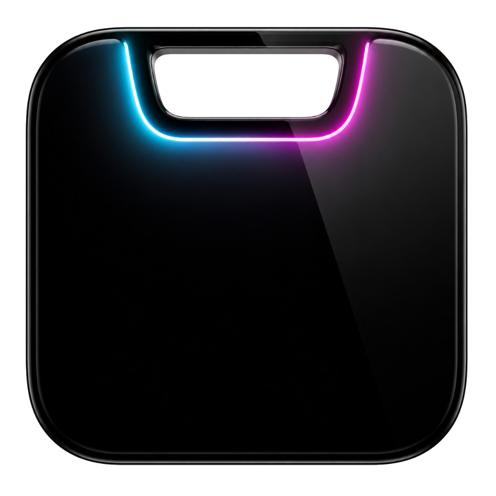
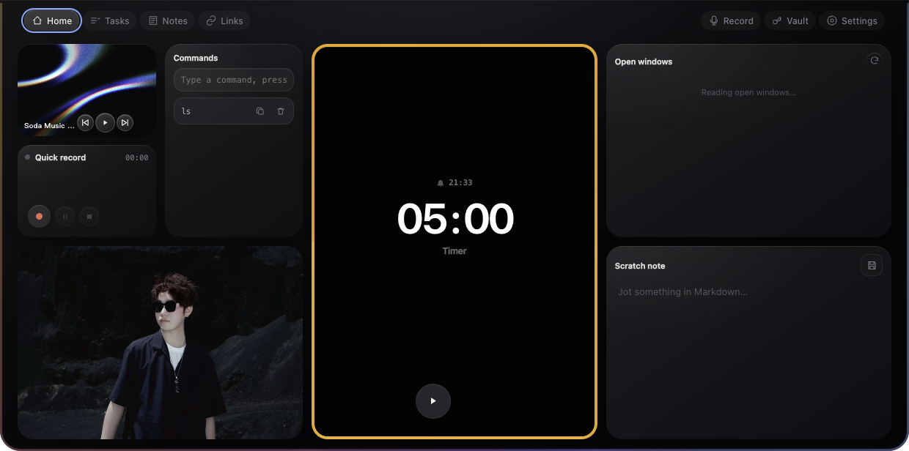
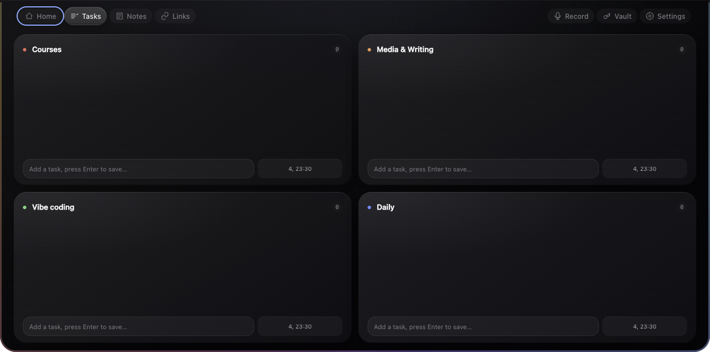

<div align="center">
  
  <h1>Headspace</h1>
  <p><strong>A top-edge workspace for Mac and Windows.</strong></p>
  <p>Tasks, scratch notes, links, recordings, and local AI alerts — always ready at the top of your screen.</p>
  <p>
    <a href="https://github.com/lioneltchami/Headspace/releases/latest"><strong>Download macOS</strong></a>
    ·
    <a href="https://github.com/lioneltchami/Headspace/releases/latest"><strong>Download Windows</strong></a>
    ·
    <a href="#run-from-source">Run from source</a>
    ·
    <a href="#changelog">Changelog</a>
    ·
    <a href="https://github.com/lioneltchami/Headspace/issues">Report an issue</a>
  </p>
  <p>
    
    
    
    
    
  </p>
</div>





## What it is

Headspace is a local workspace that stays at the top of your macOS / Windows screen. On Mac it collapses to the physical notch size; on Windows it shows as a 200 × 38 DIP top bar that avoids the taskbar. Click to expand from the top.

| Tab          | What it solves                                                                                                                                                             |
| ------------ | -------------------------------------------------------------------------------------------------------------------------------------------------------------------------- |
| **Home**     | Open windows, Mirror, Quick record, Scratch note, Commands, Soda Music, and Pomodoro in one bento workspace                                                                |
| **Tasks**    | Four renameable workflows; new items default to today 23:30; reminders one hour before due; scripts/AI can [import via files](#import-tasks-from-scripts-or-ai-assistants) |
| **Notes**    | Markdown scratch notes, archive, search, rename, and smart titles                                                                                                          |
| **Links**    | Save public URLs; titles, icons, and groups fill in in the background                                                                                                      |
| **Record**   | Recording creates a live session with status and optional transcription; configure APIs in-panel                                                                           |
| **Vault**    | Accounts, passwords, and API keys encrypted with system secure storage                                                                                                     |
| **Settings** | When the menu-bar icon is hidden by the notch, still configure APIs, Mirror, Home widgets, feature visibility, default tab, shortcut, data folder, and launch at login     |

Clipboard history is off by default; enable it from the menu bar or Settings → Visible features. Menu bar and Settings share the same local config. Codex, Claude Code, and GPT completion events can show as non-stealing top notifications.

## Download and install

> Current stable: **2.0.1** · **macOS 13.0+ Apple Silicon** / **Windows 10/11 x64**

| Platform | Download from GitHub Releases                                                                                                                     |
| -------- | ------------------------------------------------------------------------------------------------------------------------------------------------- |
| Mac      | [Headspace-2.0.1-arm64.dmg](https://github.com/lioneltchami/Headspace/releases/download/v2.0.1/Headspace-2.0.1-arm64.dmg)                         |
| Windows  | [Headspace-2.0.1-windows-x64-setup.exe](https://github.com/lioneltchami/Headspace/releases/download/v2.0.1/Headspace-2.0.1-windows-x64-setup.exe) |

### Package managers

**macOS (Homebrew, Apple Silicon):**

```bash
brew tap lioneltchami/tap
brew install --cask headspace
```

**Windows (winget)** — after the community PR merges (`Lioneltchami.Headspace`):

```powershell
winget install Lioneltchami.Headspace
```

Until then, use the Windows installer from GitHub Releases. See [docs/packaging.md](docs/packaging.md).

### macOS

1. Download `Headspace-*-arm64.dmg` from [GitHub Releases](https://github.com/lioneltchami/Headspace/releases/latest).
2. Open the DMG and drag `Headspace.app` into Applications.
3. If macOS blocks the first launch, open **System Settings → Privacy & Security** and choose **Open Anyway**.
4. Launch again and grant Accessibility, Screen Recording, Microphone, or Camera as needed.

The project ships via GitHub Releases with ad-hoc signing — not Apple notarization and not the Mac App Store. First-run “Open Anyway” is expected. Rebuilds may require re-authorization; keys encrypted with `safeStorage` may need re-entry.

### Windows

Download `Headspace-*-windows-x64-setup.exe`, run the installer, then launch from the desktop or Start menu. Per-user install by default (no admin). Uninstall keeps workspace data. Tray menu covers features and quit; Settings can enable launch at login.

The installer is not commercially code-signed, so SmartScreen may appear. Verify the source and `.sha256` checksum, then use **More info → Run anyway**. Windows first release hides Open windows and Soda Music widgets; clipboard click copies for Ctrl+V; AI alerts dismiss on click (no jump-back to the task window yet).

### Upgrading from TO-DO Panel 1.x

2.0.0 renames the app to Headspace with a new app identity (`com.lioneltchami.headspace`), so it installs side by side instead of upgrading in place:

- On first launch, Headspace copies your existing `Dynamic Panel` data folder into `Headspace` once. It never overwrites an existing `Headspace` folder, and the old folder is kept as a backup.
- macOS asks again for Camera, Microphone, Accessibility, and Automation permissions.
- Vault entries and the DashScope API key are encrypted with system secure storage and may not decrypt under the new identity — re-enter them if they appear empty.
- On Windows, install Headspace, confirm your data, then uninstall the old “TO-DO Panel” entry.

## Changelog

Current stable: **v2.0.0**. Unreleased work is tracked under `[Unreleased]` in [CHANGELOG.md](CHANGELOG.md).

## Design principles

- **Pinned, not pushy**: collapsed width 200px, height follows the menu bar; expand and notifications skip system window animations.
- **Devices on demand**: Mirror starts only on click and releases the camera when you leave Home or collapse; microphone same. Built-in camera preferred; Continuity / virtual cameras last.
- **Data stays local**: tasks, notes, links, recording metadata, and workspace settings stay on device — no backend or cloud sync.
- **Clear permission boundaries**: link fetching blocks localhost, private networks, and unsafe redirects; window focus only accepts IDs from the latest scan cache.
- **Portable workspace**: pick a data folder from the menu bar and copy it between machines.

## Local AI completion alerts

Headspace listens only on `127.0.0.1:43821` for `/notify/<source>`, sources limited to `codex`, `claude`, and `gpt`:

```bash
curl -X POST http://127.0.0.1:43821/notify/codex \
  -H 'Content-Type: application/json' \
  -d '{"title":"Task completed","project":"my-project","task_id":"demo"}'
```

Ship scripts: [scripts/codex-notify.js](scripts/codex-notify.js) and [scripts/claude-notify.js](scripts/claude-notify.js). After DMG install:

```text
/Applications/Headspace.app/Contents/Resources/app/scripts/codex-notify.js
/Applications/Headspace.app/Contents/Resources/app/scripts/claude-notify.js
```

On Windows, both scripts live under `resources/app/scripts/` in the install directory. Call them with Node.js; the app itself does not require users to install Node.

## Import tasks from scripts or AI assistants

Drop JSON into the workspace `todo-inbox/` folder. Headspace checks about every 2 seconds (and on launch). Import only appends; it never edits or deletes existing tasks.

| Workspace          | Inbox path                                            |
| ------------------ | ----------------------------------------------------- |
| macOS default      | `~/Library/Application Support/Headspace/todo-inbox/` |
| Windows default    | `%APPDATA%\Headspace\todo-inbox\`                     |
| Custom data folder | `<chosen folder>/todo-inbox/`                         |

See current path under **Settings → Data folder** or the menu-bar **Open folder** item.

**Format**: top level may be `{ "todos": [...] }` or a bare array. Example: [docs/todo-inbox-example.json](docs/todo-inbox-example.json).

| Field      | Required | Notes                                                                                            |
| ---------- | -------- | ------------------------------------------------------------------------------------------------ |
| `text`     | yes      | Task text, max 80 characters                                                                     |
| `category` | yes      | `P0`–`P3` (case-insensitive) or a current display name; `P0`–`P3` wins on conflict               |
| `deadline` | no       | ISO 8601 or millisecond timestamp; date-only becomes that day 23:30 local; omitted = today 23:30 |
| `id`       | no       | Letters, digits, `. _ : -`, max 128; existing ids are skipped                                    |

```bash
# Write a temp file, then rename — avoids reading a half-written file
cp docs/todo-inbox-example.json ~/Library/Application\ Support/Headspace/todo-inbox/.agent.tmp
mv ~/Library/Application\ Support/Headspace/todo-inbox/.agent.tmp \
   ~/Library/Application\ Support/Headspace/todo-inbox/agent-$(date +%s).json
```

Processed files move to `todo-inbox/processed/` with a timestamp prefix and a sibling `.report.json`.

## Run from source

Desktop needs Node.js 22.12.0+:

```bash
git clone https://github.com/lioneltchami/Headspace.git
cd Headspace
npm install
npm test
npm start
```

Single Electron architecture — no renderer build step. `npm start` is the full run path.

| Command             | Purpose                         |
| ------------------- | ------------------------------- |
| `npm test`          | Unit tests and JS syntax checks |
| `npm start`         | Start Electron in development   |
| `npm run pack`      | Unpackaged `.app`               |
| `npm run build`     | Apple Silicon DMG               |
| `npm run build:win` | Windows x64 NSIS installer      |
| `npm run build:zip` | ZIP distribution                |

Website lives in `website/` (Node.js 22.13.0+):

```bash
cd website
npm install
npm run dev
```

## Project layout

```text
.
├── main.js                 # Electron main process, window, system services
├── main-services.js        # Testable pure domain services
├── preload.js              # contextBridge security bridge
├── renderer/               # Desktop UI and interaction
├── tests/                  # Node unit tests
├── build/                  # Icons, signing, DMG config
├── scripts/                # Codex / Claude Code notify relays
├── docs/                   # Design, ADRs, release notes
└── website/                # React 19 + Vinext marketing site
```

## Release

Push a `v*.*.*` tag matching `package.json`. GitHub Actions tests, builds, and verifies the macOS DMG and Windows EXE, then creates one Release with both installers and SHA-256 files. Full flow: [docs/releasing.md](docs/releasing.md).

## License

[MIT](LICENSE) © 2026 [lioneltchami](https://github.com/lioneltchami)
